

**Aspiring Software Engineer · BCA · Open Source Enthusiast**

## A little about me

I'm **Sathwik B R**, a Java full stack developer who enjoys building practical projects and learning how software works from the interface to the database. I also create YouTube content and explore digital marketing.

- **Experience:** Java Full Stack Intern — Sri JCBM College + MTD Mysore.
- **Working with:** Java, Spring Boot, React, REST APIs, and MySQL.
- **Exploring next:** Spring Security, Docker, Kubernetes, cloud computing, AI, and system design.
- **My approach:** Code. Learn. Build. Repeat.

## My toolkit

| Area | Technologies |
| :--- | :--- |
| Languages |  |
| Frontend |  |
| Backend & data |  |
| Development tools |  |
| Learning & exploring |  |

## Projects I've worked on

| Project | Built with |
| :--- | :--- |
| **Online Blood Donation System** | Spring Boot · React · MySQL |
| **Face Recognition Attendance System** | Python · Flask · OpenCV |
| **Gaming Web Platform** | HTML · CSS · JavaScript |
| **Library Management System** | C# |

[Explore my repositories →](https://github.com/SathwikBRGowda9?tab=repositories)

## GitHub contribution totals

These totals come from GitHub's contribution calendars, summed from my account creation year and refreshed daily. They include contributions visible to the workflow; private activity may be excluded. Contributions are GitHub-counted activity, not every Git commit.

[View yearly totals](https://github.com/SathwikBRGowda9/SathwikBRGowda9/blob/output/contribution-stats.json) · [View my live contribution calendar](https://github.com/SathwikBRGowda9?tab=overview)

## Contributions in motion

<picture>
  <source media="(prefers-color-scheme: dark)" srcset="https://raw.githubusercontent.com/SathwikBRGowda9/SathwikBRGowda9/output/github-contribution-grid-snake-dark.svg" />
  <source media="(prefers-color-scheme: light)" srcset="https://raw.githubusercontent.com/SathwikBRGowda9/SathwikBRGowda9/output/github-contribution-grid-snake.svg" />
  
</picture>

Updated daily with GitHub Actions.

### Streak and recent activity

  

## Certifications

- **Java Swing GUI** — Udemy
- **Digital 101 Journey** — FutureSkills Prime (NASSCOM)

---

**Learning something new, one commit at a time.**

Thanks for stopping by. Explore a project or [learn along with me on YouTube](https://youtube.com/@Learncodewithtech).

